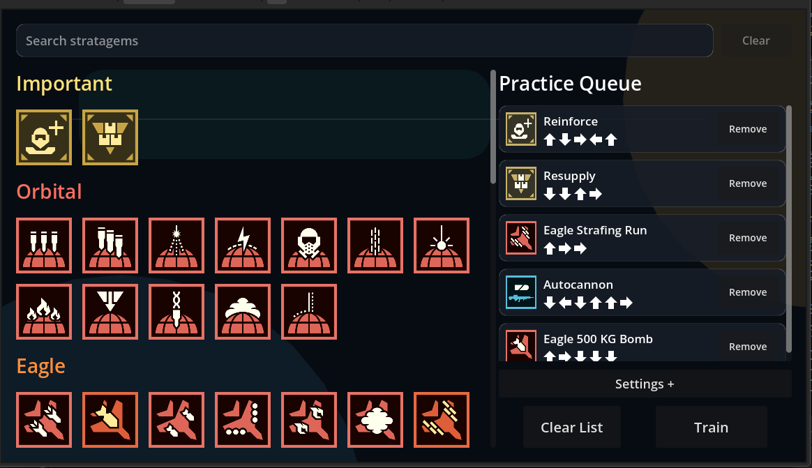
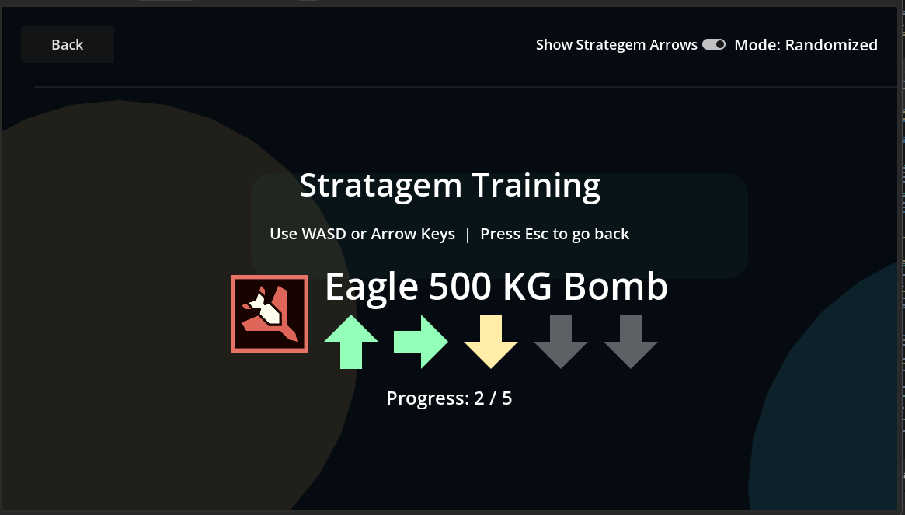

# Helldivers 2 Strategem Mini Game

Practice/Training Mini-game for practicing Helldivers 2 stratagem input sequences in Godot.

## Screenshots

### Main Screen

### Train Screen

## Credits / Sources

### SVG icon source

- https://github.com/nvigneux/Helldivers-2-Stratagems-icons-svg

### Stratagem data source

- https://github.com/k33bs/Helldivers-2-Stratagem-JSON-Generator

### Sound effects source

- https://kenney.nl/assets/interface-sounds
- Used in project:
  - `Assets/audio/tick_002.ogg`
  - `Assets/audio/error_006.ogg`
  - `Assets/audio/confirmation_003.ogg`
