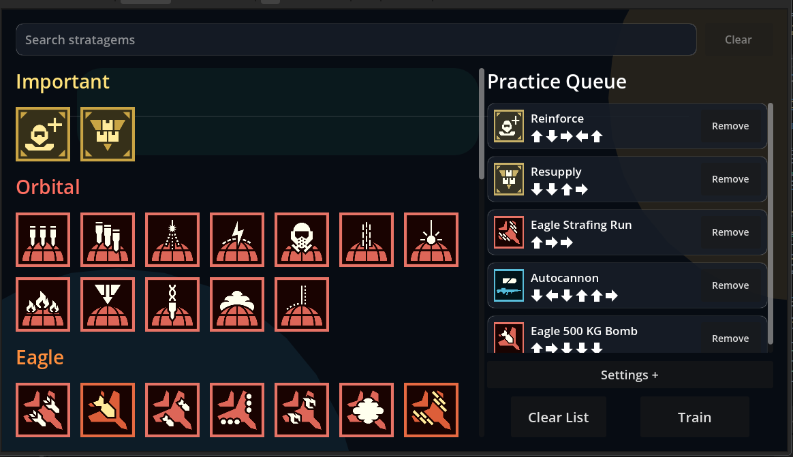
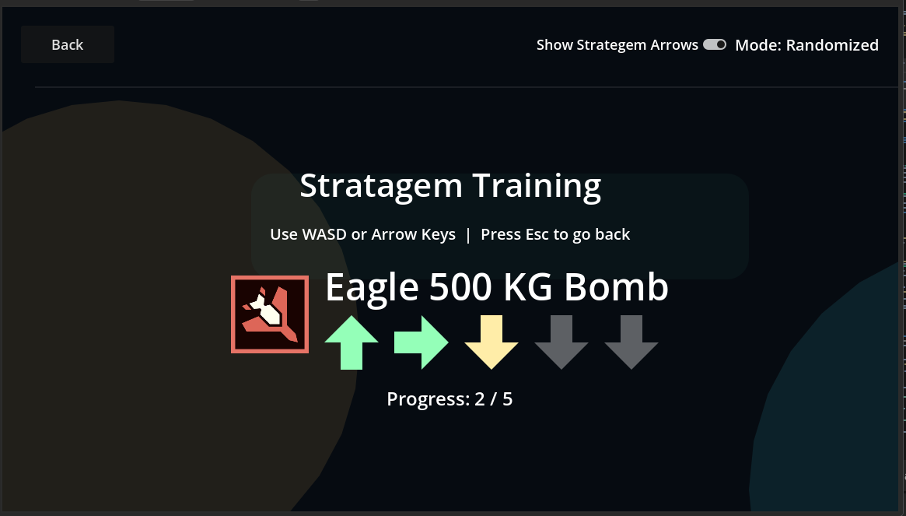
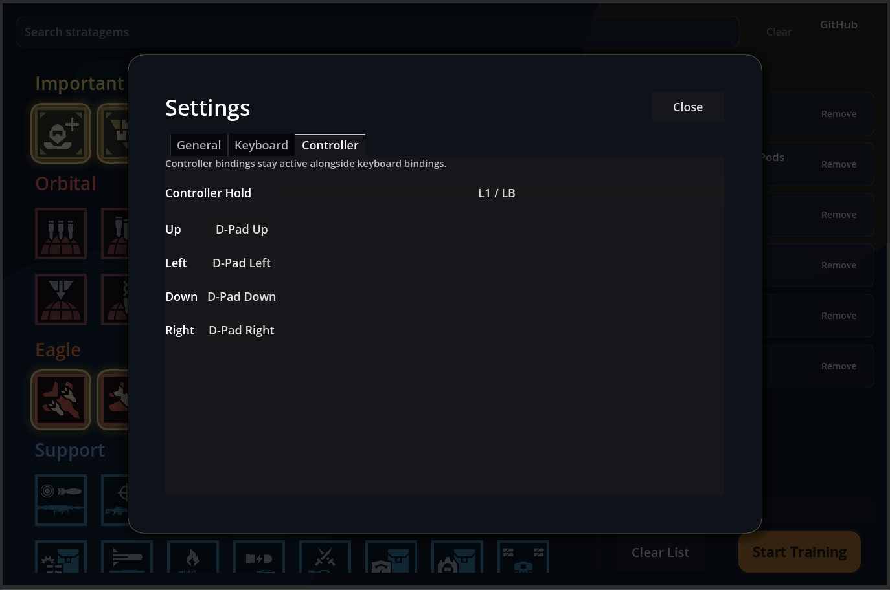

# Helldivers 2 Strategem Mini Game

Practice/Training Mini-game for practicing Helldivers 2 stratagem input sequences.

Supports keyboard/mouse, controller, and mobile touch input. Keyboard and controller controls can be remapped.

The Web export is an installable Progressive Web App. Open the GitHub Pages version online once, then use **Install / Add Offline App** on the main screen. If Brave does not show its install prompt, open the browser menu or share sheet and choose **Install app** or **Add to Home screen**. GitHub release ZIP files are downloads; the installable app comes from the Pages URL. Browser storage can still be cleared or evicted by the operating system, so offline availability is not permanent storage.

On phones and touch devices, the catalogue and practice queue adapt to the screen orientation. Training places a large SVG four-way touch pad below the target in portrait and to the target's left in landscape. Adjust **Settings → General → Touch Buttons** from 80% to 180%. When **Require Holding** is enabled, hold the gold **HOLD INPUT** button with one finger while tapping directions with another.

Includes the current developer-released catalogue through the June 2026 FRV variants and the April 2026 Exo Experts Warbond.

## Player-created stratagems

Use **+ Custom Stratagem** on the main screen to add, edit, or delete your own entries. Each entry supports:

- A custom name and category
- A 1–20 direction input code, entered with arrow symbols or `U`, `D`, `L`, and `R`
- PNG, JPG, WebP, or SVG icons up to 3 MB and 2048 × 2048 pixels

Custom entries, icons, practice queues, and stats stay on the player's own system. Desktop builds use Godot's per-user application-data directory. Web builds use the browser's persistent local Godot filesystem (IndexedDB); data is local to that browser profile and device and is not uploaded.

Right-click a custom stratagem icon to edit it quickly.

Made with [Godot Engine](https://godotengine.org/).

## Play Online

https://stmsi.github.io/hd2-stratagems-mini-game-training/

## Screenshots

### Main Screen

### Train Screen

### Settings

## Credits / Sources

### SVG icon source

- https://github.com/nvigneux/Helldivers-2-Stratagems-icons-svg

### Stratagem data source

- https://github.com/k33bs/Helldivers-2-Stratagem-JSON-Generator
- https://helldivers.wiki.gg/wiki/Stratagems
- https://blog.playstation.com/2026/04/21/helldivers-2-the-exo-experts-warbond-drops-april-28/

### Sound effects source

- https://kenney.nl/assets/interface-sounds
- Used in project:
  - `Assets/audio/tick_002.ogg`
  - `Assets/audio/error_006.ogg`
  - `Assets/audio/confirmation_003.ogg`
